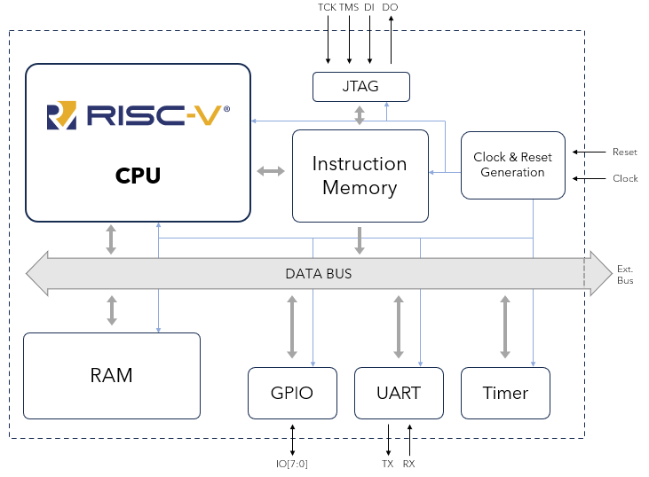
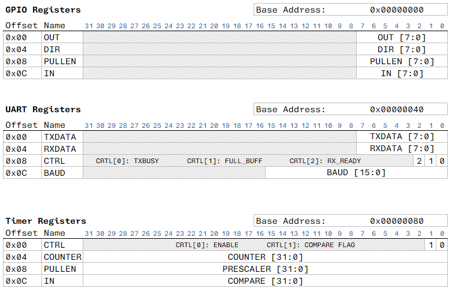

# RVCPU SoC — RISC‑V based system

This repository contains a small SystemVerilog SoC built around a custom
RISC‑V CPU (RV32I + M extensions). The design includes three on‑chip
peripherals (GPIO, UART and Timer) connected over a Wishbone bus and a
programmable instruction memory (JTAG programmable).

## System overview

The CPU implements the I and M extensions (RV32IM). Peripherals are memory‑
mapped and accessed through a Wishbone interconnect.

The instruction memory can be programmed via the JTAG interface (see the
`gcc-toolchain` and `tests/` folders for examples and testbenches).

## Peripherals and registers

The repository includes a compact summary of peripheral base addresses and
internal registers:

If you enable the directive `\`define EXPOSE_WB_BUS\`` the Wishbone bus
interface is exposed so additional peripherals can be attached from a top
level testbench or external module.

## Folder layout

- `src/` — SystemVerilog RTL (CPU, peripherals, interconnect, top-level).
- `gcc-toolchain/` — Toolchain and helper scripts to build programs for the
	CPU (see `gcc-toolchain/README.md` for usage: compile with `make all`).
- `tests/` — Verilator-based testbenches and examples (GPIO, JTAG, UART, etc.).
- `support/` — scripts, images and helper files (including the diagrams above).
- `gcc-toolchain/` — cross-compiler wrappers and converter script used to
	generate `instr_mem.bin` compatible with Verilog `$readmemb`.

## Compiling programs

To build a C program for the CPU place your `main.c` in `gcc-toolchain/` and
run `make all` in that folder; the Makefile uses `riscv64-unknown-elf-gcc` and
the Python converter to emit an ASCII binary file suitable for `$readmemb`.
Refer to `gcc-toolchain/README.md` for details and troubleshooting.

## External peripherals

When `EXPOSE_WB_BUS` is defined the top-level exposes the Wishbone bus. You
can add external peripherals by connecting them to the bus — map them into the
peripheral region starting at `32'h10000000` with a maximum span of
`32'h00100000`.

## Getting started / Simulation

- Build and run the Verilator testbenches in `tests/` (each test directory
	contains a Makefile). Copy `instr_mem.bin` produced by `gcc-toolchain` into
	the testbench working directory so the DUT can load the instruction memory.

